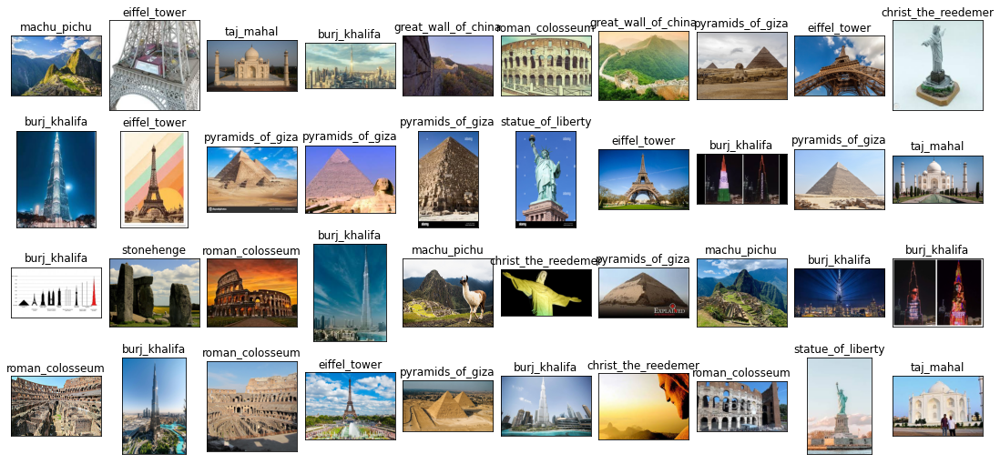

## Landmark Classifier

> This classifier can classify 12 Lanmarks, 'burj_khalifa','chichen_itza','christ_the_reedemer','eiffel_tower','great_wall_of_china', 'machu_pichu','pyramids_of_giza','roman_colosseum','statue_of_liberty','stonehenge','taj_mahal', and 'venezuela_angel_falls'.

### Image Set Source

* This imageset was taken from [Wonders of the World Image Dataset] (https://www.kaggle.com/datasets/balabaskar/wonders-of-the-world-image-classification)

### First Deep Learning Model : VGG16

* We use this model for first Deep Learning model making.